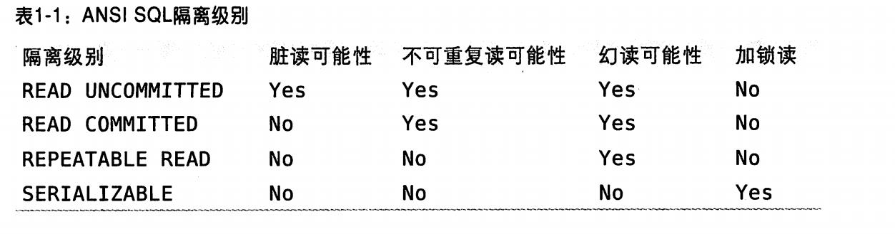

# 事务

``` wiki
一组原子性SQL查询，事务实现也是要消费资源的。所以可以自己决定
```


## 理论

- 特性

  1. 原子性 atomicity

     ``` wiki
     事务就是整体，不可分隔，要么成功（全部成功）要么失败（只要有一个不成功）
     ```

     

  2. 一致性 consistency

     ``` wiki
     事务前后数据状态是整体转换的，从一个一致性到另一个一致性。因为原子性决定了，不会进行部分操作，如果有就回滚
     ```

     

  3. 隔离性 isolation

     ``` wiki
     事务提交之前的更改，其它事务是不可见的。
     ```

     

  4. 持久性 durability

     ``` wiki
     一但提交，则所做的修改会永远保存到数据库中，但是因为数据库可能崩溃，有的通过备份，不论如何也不能保证100% ，但能保持n个9也是可以的。
     ```

     

     

  

## 实操

- 开启一个事务

  ``` sql
  start transaction;
  ***sql语句
  commit;
  ```

  

- 

## 隔离级别

1. 读未提交 READ UNCOMMITTED

   ``` wiki
   俗称：脏读 就是能读到事务没有提交的数据，一般不用
   ```

   

2. 读提交 READ COMMITED

   ``` wiki
   俗称：不可重复读 幻读 就是你第二次读的时候可能读到别的事务提交的数据
   其它数库默认级别，mysql不是，不是mysql的。
   ```

   

3. 可重复读 REPEATABLE READ

   ``` wiki
   默认级别
   解决了脏读，通（MVCC 多版本并发控制）解决幻读
   ```

   

4. 可串行化

   ``` wiki
   事务串行执行，解决了幻读。但是加锁会带来超时和锁争用的问题。很少用 
   ```

   

   

## 事务日志

1. 提交效率，顺序IO不会随机移动磁头
2. 修改要写两次磁盘
3. 不同的存储引擎有不同的异常处理方法
   
## mysql事务
1. 自动提交：如果不显示的开始一个事务，每个查询都当作一个事务执行提交操作，可以通过下面命令更改
   ``` shell
   show variables like 'autocommit';
   set autocommit =1; #1表示on 0表示off
   set session transaction isolation level read committed;#更改隔离级别
   ```
2. 混合使用存储引擎：尽量不要用，不同的引擎级别不一样，有的不能回滚
3. 隐式和显式锁定:
   - 隐式    
   InnoDB会根据需要在事务的任何时候加锁。只有执行commit或都rollback才会释放，并且所有的锁同时释放。
   - 显式
   ``` sql
   select ... lock in share mode
   select ... for update
   ```
4. 多版本并发控制
   - 说明
     锁的一个变种，很多情况下避免了加锁操作，因此开销更低
     实现了非阻塞读，写也是行级锁（通过某个时间点[系统版本号]的快照实现的）
   - 只在read commit 和repeatable read两个级别下生效