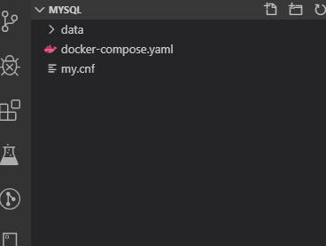
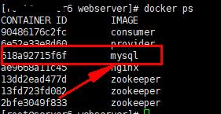
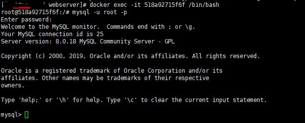
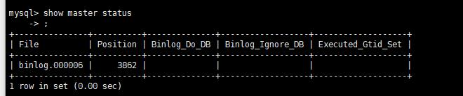
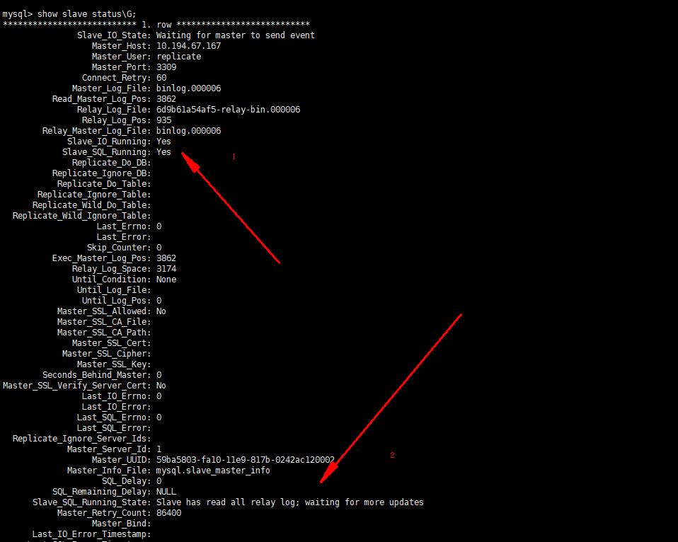

# 基于docker的mysql8的主从复制

## 创建mysql的docker镜像

- 构建docker镜像，其中数据卷配置内容在下面,结构目录如下

  

  ``` yaml
  version: '3.7'
  services: 
      db:
        # images 8.x
        image: mysql
        restart: always
        environment: 
          MYSQL_ROOT_PASSWORD: 456123
        command: 
          --default-authentication-plugin=mysql_native_password
          --character-set-server=utf8mb4
          --collation-server=utf8mb4_general_ci
          --explicit_defaults_for_timestamp=true
          --lower_case_table_names=1
        ports: 
          - 3309:3306
        volumes: 
          - ./data:/var/lib/mysql
          - ./my.cnf:/etc/my.cnf
      
  ```

  

## 配置mysql的主库

- 更新配置文件

  ``` wiki
  # Copyright (c) 2017, Oracle and/or its affiliates. All rights reserved.
  #
  # This program is free software; you can redistribute it and/or modify
  # it under the terms of the GNU General Public License as published by
  # the Free Software Foundation; version 2 of the License.
  #
  # This program is distributed in the hope that it will be useful,
  # but WITHOUT ANY WARRANTY; without even the implied warranty of
  # MERCHANTABILITY or FITNESS FOR A PARTICULAR PURPOSE.  See the
  # GNU General Public License for more details.
  #
  # You should have received a copy of the GNU General Public License
  # along with this program; if not, write to the Free Software
  # Foundation, Inc., 51 Franklin St, Fifth Floor, Boston, MA  02110-1301 USA
  
  #
  # The MySQL  Server configuration file.
  #
  # For explanations see
  # http://dev.mysql.com/doc/mysql/en/server-system-variables.html
  
  [mysqld]
  
  pid-file        = /var/run/mysqld/mysqld.pid
  socket          = /var/run/mysqld/mysqld.sock
  datadir         = /var/lib/mysql
  secure-file-priv= NULL
  # Disabling symbolic-links is recommended to prevent assorted security risks
  symbolic-links=0
  
  # Custom config should go here
  # [必须]启用二进制日志
  log-bin=mysql-bin 
  # [必须]服务器唯一ID，默认是1  1~255
  server-id=1 
  sql_mode=STRICT_TRANS_TABLES,NO_ENGINE_SUBSTITUTION
  
  ```

  

- 配置操作

  1. 启动mysql

     ``` shell 
     docker-compose up -d 
     ```

     

  2. 更新配置

     - 查看容器

       ``` shell
       docker ps
       
       ```

       

       - 进入mysql交互

         ``` shell
          docker exec -it 518a92715f6f /bin/bash
         
         ```

         

       - 登录mysql

         ``` shell
          mysql -u root -p
         
         ```

         

       - 配置

         ``` shell
         #在主库上创建同步用户并授权
         CREATE USER 'replicate'@'112.74.41.236' IDENTIFIED BY '123456';
         GRANT REPLICATION SLAVE ON *.* TO 'replicate'@'112.74.41.236';
         FLUSH PRIVILEGES;
         #最后增加远程访问用户 并赋予所有权限，远程访问测试用
         CREATE USER antsdouble IDENTIFIED BY '123456';
         GRANT ALL ON *.* TO 'antsdouble'@'%';
         #用navicate12及以上可以不用修复修复远程登录报报 caching_sha2_password异常
         # mysql8 用新的驱动  driver-class-name: com.mysql.cj.jdbc.Driver
         ALTER USER 'antsdouble'@'%' IDENTIFIED BY '123456' PASSWORD EXPIRE NEVER;
         ALTER USER 'antsdouble'@'%' IDENTIFIED WITH mysql_native_password BY '123456';
         FLUSH PRIVILEGES;
         #查询master的状态，此处File，Position数据在配置从库时用到
         show master status;
         ```

         

   

     

- 相关说明

  1. server-id是唯一的，主从不能相同，server-id为1表示mysq数据库为主数据库，server-id为2表示mysql的数据库为从数据库 
  
  2. 为何必须挂载到/etc/my.cnf 文件上，而不是/etc/mysql/my.cnf 文件上？因为mysql默认配置文件位置在/etc/mysql/my.cnf，挂在方式无法改变容器中文件内容，my.conf内容不会改变，my.cnf中没有我们自定义的配置内容，启动mysql容器会报错
  
     ``` wiki
     lower_case_table_names：忽略表名、列名等数据结构的大小写（注意：不是每行记录内容的大小写！）。
     
     
     log-bin：开启二进制记录。这是为了主从复制而做的设置。本文使用RBR（Row-Based Replication）模式。
     
     slow_query_log=1：开启慢查询日志。如果某一条SQL执行的时间超过long_query_time设置的秒数，那么就记录下来。记录文件路径可以使用show variables;命令，在变量名是slow_query_log_file下查找到具体的日志文件路径。
     
     long_query_time=1：单位是秒。指如果某一条SQL语句执行时间超过1秒，就记录下来。必须开启慢查询日志了以后，此变量才能使用。
     
     log_error：开启错误日志。show variables like 'log_error'; 就可以查询到日志文件的路径。mysql的docker官方镜像如果设置别的取值会导致容器无法正常启动。
     ```
  
     
  
     

## 配置mysql的从库

- 更新配置文件

  ``` wiki
  # Copyright (c) 2017, Oracle and/or its affiliates. All rights reserved.
  #
  # This program is free software; you can redistribute it and/or modify
  # it under the terms of the GNU General Public License as published by
  # the Free Software Foundation; version 2 of the License.
  #
  # This program is distributed in the hope that it will be useful,
  # but WITHOUT ANY WARRANTY; without even the implied warranty of
  # MERCHANTABILITY or FITNESS FOR A PARTICULAR PURPOSE.  See the
  # GNU General Public License for more details.
  #
  # You should have received a copy of the GNU General Public License
  # along with this program; if not, write to the Free Software
  # Foundation, Inc., 51 Franklin St, Fifth Floor, Boston, MA  02110-1301 USA
  
  #
  # The MySQL  Server configuration file.
  #
  # For explanations see
  # http://dev.mysql.com/doc/mysql/en/server-system-variables.html
  
  [mysqld]
  
  pid-file        = /var/run/mysqld/mysqld.pid
  socket          = /var/run/mysqld/mysqld.sock
  datadir         = /var/lib/mysql
  secure-file-priv= NULL
  # Disabling symbolic-links is recommended to prevent assorted security risks
  symbolic-links=0
  
  # Custom config should go here
  # [必须]启用二进制日志
  log-bin=mysql-bin 
  # [必须]服务器唯一ID，默认是1
  server-id=1 
  sql_mode=STRICT_TRANS_TABLES,NO_ENGINE_SUBSTITUTION
  ```

  

- 配置操作

  1. 进入交互模式，方法同主库

  2. 配置从库

      ``` shell
     change master to master_host='112.74.41.236',master_port=3309,master_user='replicate',master_password='123456',master_log_file='binlog.000006',master_log_pos=3862;
     ```
     - 说明

       ``` wiki
       master_port：Master的端口号，指的是容器的端口号
       
       master_user：用于数据同步的用户
       
       master_password：用于同步的用户的密码
       
       master_log_file：指定 Slave 从哪个日志文件开始复制数据，即上文中提到的 File 字段的值
       
       master_log_pos：从哪个 Position 开始读，即上文中提到的 Position 字段的值
       
       master_connect_retry：如果连接失败，重试的时间间隔，单位是秒，默认是60秒
       ```

       

     

  3. 查看

     ``` shell
     show slave status\G
     # 查询slave的状态，Slave_IO_Running及Slave_SQL_Running进程必须正常运行，即YES状态，否则都是错误的状态 错误可以在2标记处查看到原因，也可以通过
     show slave status;
     ```

     

     

  
  

## 测试功能

- 主库添加一条数
- 在从库查看

## 常见问题

- 可能产生的原因

  ``` wiki
  网络不通
  
  检查ip,端口
  
  密码不对
  
  检查是否创建用于同步的用户和用户密码是否正确
  
  pos不对
  
  检查Master的 Position
  ```

  

- Could not execute Update_rows event on table oa.bui_bill_sum; Can't find record in 'bui_bill_sum', Error_code: 1032; handler error HA_ERR_KEY_NOT_FOUND; the event's master log mysql-bin.000138, end_log_pos 160051747

  1. 解决，临时

     ``` shell
     进入sql 执行
     STOP SLAVE; 
     SET GLOBAL sql_slave_skip_counter =1; #表示跳过一步错误，后面的数字可变 
     START SLAVE;  
     ```

     

  2. 永久

     ``` wiki
     在my.cnf中配置
     slave-skip-errors = 1032 就会跳过所有的1032的错误,多个用逗号分隔
     ```

     

-  mysql并没有从my.cnf文件中更新server_id，既然这样就只能手动修改了 

  ``` shell
  set global server_id=2; #此处的数值和my.cnf里设置的一样就行
  slave start;
  ```

  

- 