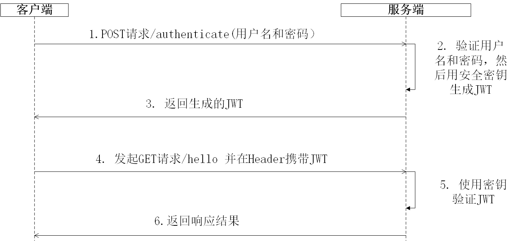
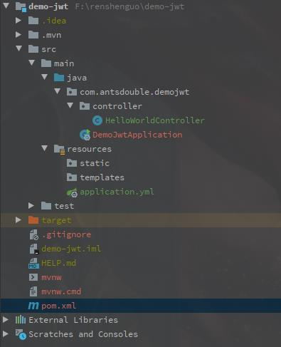
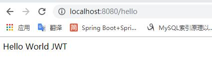
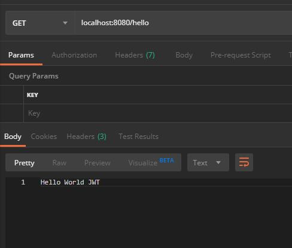
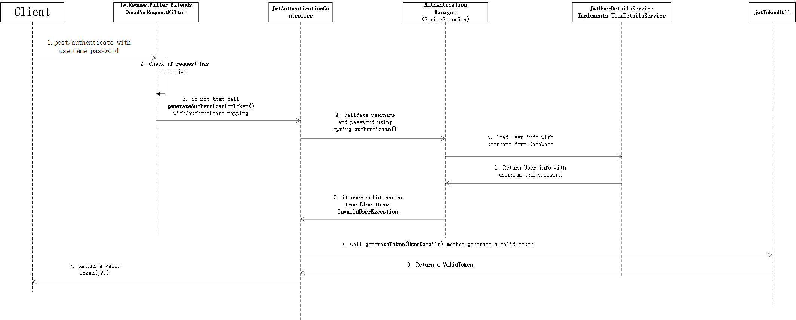
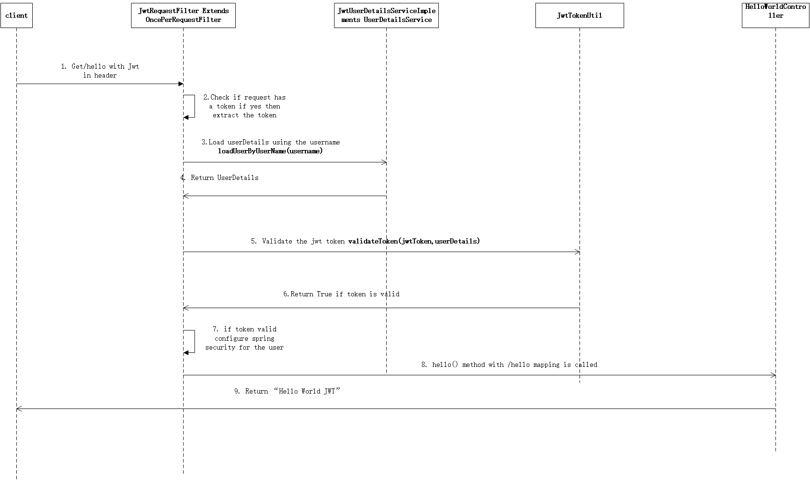
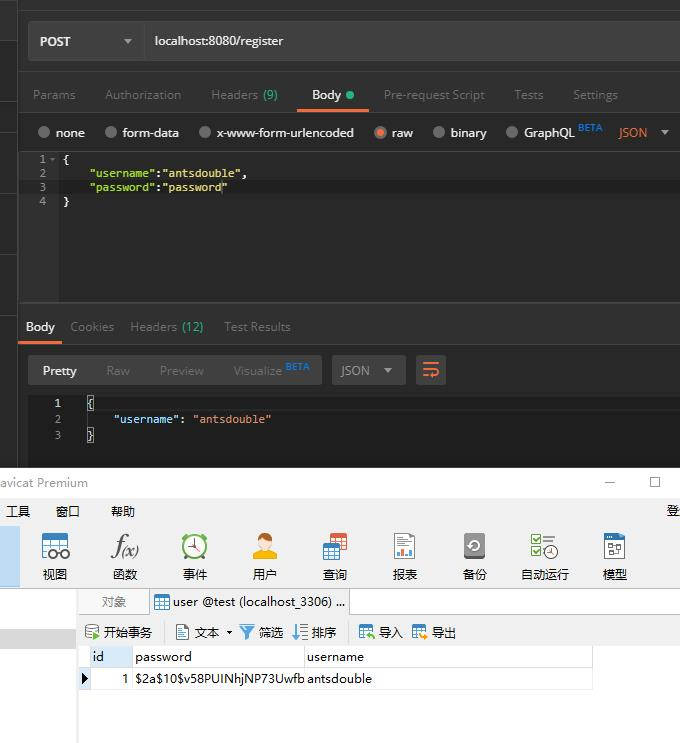
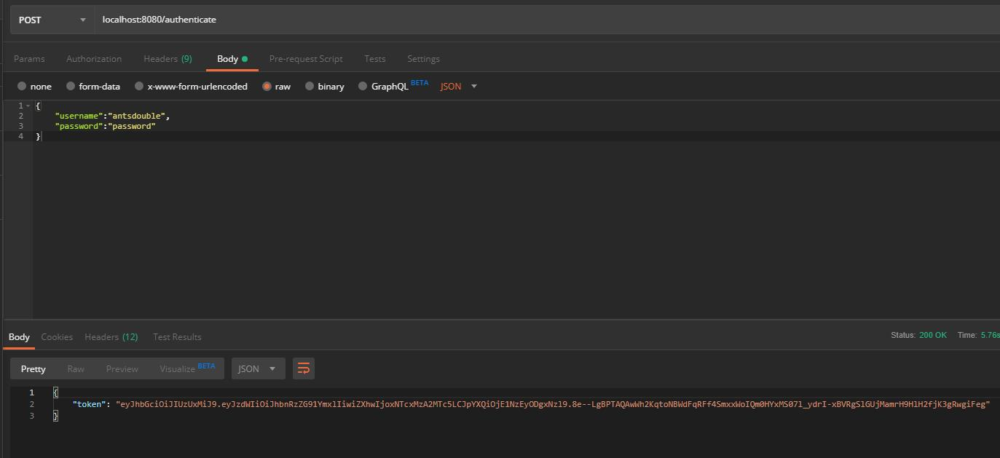
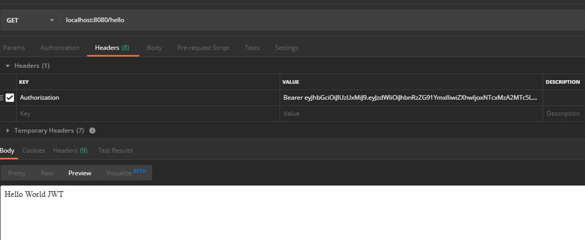

#  Spring Boot Security And JSON Web Token 说明

## 流程说明

- 何时生成和使用jwt，其实我们主要是token更有意义并携带一些信息

   https://github.com/Ants-double/huanhuncao/tree/master/visio 
  
  

## 实操准备

- 新建一个spring boot 项目，并添加hello请求

  1. 工程目录结构如下

     

     2.  HelloWorldController 代码如下

        ``` java
        package com.antsdouble.demojwt.controller;
        
        import org.springframework.web.bind.annotation.GetMapping;
        import org.springframework.web.bind.annotation.RestController;
        
        @RestController
        public class HelloWorldController {
        
            @GetMapping(value = {"/hello"})
            public String hello() {
                return "Hello World JWT";
            }
        }
        ```

     3.  请求结果 

        

        

- 配置Spring Security 和JWT

  - 完整 的pom.xml

    ``` xml
    <?xml version="1.0" encoding="UTF-8"?>
    <project xmlns="http://maven.apache.org/POM/4.0.0" xmlns:xsi="http://www.w3.org/2001/XMLSchema-instance"
             xsi:schemaLocation="http://maven.apache.org/POM/4.0.0 https://maven.apache.org/xsd/maven-4.0.0.xsd">
        <modelVersion>4.0.0</modelVersion>
        <parent>
            <groupId>org.springframework.boot</groupId>
            <artifactId>spring-boot-starter-parent</artifactId>
            <version>2.2.0.RELEASE</version>
            <relativePath/> <!-- lookup parent from repository -->
        </parent>
        <groupId>com.antsdouble</groupId>
        <artifactId>demo-jwt</artifactId>
        <version>0.0.1-SNAPSHOT</version>
        <name>demo-jwt</name>
        <description>Demo project for Spring Boot</description>
        <properties>
            <project.build.sourceEncoding>UTF-8</project.build.sourceEncoding>
            <project.reporting.outputEncoding>UTF-8</project.reporting.outputEncoding>
            <java.version>1.8</java.version>
        </properties>
    
        <dependencies>
            <dependency>
                <groupId>org.springframework.boot</groupId>
                <artifactId>spring-boot-starter-web</artifactId>
            </dependency>
    
            <dependency>
                <groupId>org.springframework.boot</groupId>
                <artifactId>spring-boot-starter-test</artifactId>
                <scope>test</scope>
                <exclusions>
                    <exclusion>
                        <groupId>org.junit.vintage</groupId>
                        <artifactId>junit-vintage-engine</artifactId>
                    </exclusion>
                </exclusions>
            </dependency>
            <dependency>
                <groupId>org.springframework.boot</groupId>
                <artifactId>spring-boot-starter-security</artifactId>
            </dependency>
            <dependency>
                <groupId>io.jsonwebtoken</groupId>
                <artifactId>jjwt</artifactId>
                <version>0.9.1</version>
            </dependency>
            <dependency>
                <groupId>org.springframework.boot</groupId>
                <artifactId>spring-boot-starter-data-jpa</artifactId>
            </dependency>
            <dependency>
                <groupId>mysql</groupId>
                <artifactId>mysql-connector-java</artifactId>
            </dependency>
        </dependencies>
    
        <build>
            <plugins>
                <plugin>
                    <groupId>org.springframework.boot</groupId>
                    <artifactId>spring-boot-maven-plugin</artifactId>
                </plugin>
            </plugins>
        </build>
    
    </project>
    
    ```

    

  1. 生成jwt

      https://github.com/Ants-double/huanhuncao/tree/master/visio 

     ``` wi
     如果请求authenticate 则会生成jwt
     ```

     

      

  2.  检证 jwt

  ​    https://github.com/Ants-double/huanhuncao/tree/master/visio 

  ``` wiki
     1. 请求业务接口带上jwt 先验证通过后再处理具体的请求
  ```

     

     

- 配置数据库相关

  1. application.yml 
  
     ``` yml
      jwt:
            secret: javainuse
          spring:
            datasource:
              url: jdbc:mysql://localhost:3306/test?useUnicode=true&characterEncoding=utf-8&useSSL=false&serverTimezone=CTT
              username: root
              password: 456123
              platform: mysql
            jpa:
              hibernate:
                ddl-auto: create-drop
     ```
  
     
  
  2.  添加对应的DTO 和DAO
  
     ``` java
     package com.antsdouble.demojwt.model;
     
     /**
      * @author lyy
      * @Deprecated
      * @date 2019/10/17
      */
     public class UserDTO {
         private String username;
         private String password;
     
         public String getUsername() {
             return username;
         }
     
         public void setUsername(String username) {
             this.username = username;
         }
     
         public String getPassword() {
             return password;
         }
     
         public void setPassword(String password) {
             this.password = password;
         }
     }
     
     ```
  
     ``` java
     package com.antsdouble.demojwt.dao;
     
     import com.antsdouble.demojwt.model.DAOUser;
     import org.springframework.data.repository.CrudRepository;
     import org.springframework.stereotype.Repository;
     
     /**
      * @author lyy
      * @Deprecated
      * @date 2019/10/17
      */
     
     @Repository
     public interface UserDao extends CrudRepository<DAOUser, Integer> {
         DAOUser findByUsername(String username);
     }
     
     ```
  
     
  
  3.  JwtAuthenticationController
  
     ``` java
     package com.antsdouble.demojwt.controller;
     
     import com.antsdouble.demojwt.config.JwtTokenUtil;
     import com.antsdouble.demojwt.model.JwtRequest;
     import com.antsdouble.demojwt.model.JwtResponse;
     import com.antsdouble.demojwt.model.UserDTO;
     import com.antsdouble.demojwt.service.JwtUserDetailsService;
     import org.springframework.beans.factory.annotation.Autowired;
     import org.springframework.http.ResponseEntity;
     import org.springframework.security.authentication.AuthenticationManager;
     import org.springframework.security.authentication.BadCredentialsException;
     import org.springframework.security.authentication.DisabledException;
     import org.springframework.security.authentication.UsernamePasswordAuthenticationToken;
     import org.springframework.security.core.userdetails.UserDetails;
     import org.springframework.web.bind.annotation.*;
     
     /**
      * @author lyy
      * @Deprecated
      * @date 2019/10/17
      */
     @RestController
     @CrossOrigin
     public class JwtAuthenticationController {
         @Autowired
         private AuthenticationManager authenticationManager;
         @Autowired
         private JwtTokenUtil jwtTokenUtil;
         @Autowired
         private JwtUserDetailsService userDetailsService;
         @RequestMapping(value = "/authenticate", method = RequestMethod.POST)
         public ResponseEntity<?> createAuthenticationToken(@RequestBody JwtRequest authenticationRequest) throws Exception {
             authenticate(authenticationRequest.getUsername(), authenticationRequest.getPassword());
             final UserDetails userDetails = userDetailsService
                     .loadUserByUsername(authenticationRequest.getUsername());
             final String token = jwtTokenUtil.generateToken(userDetails);
             return ResponseEntity.ok(new JwtResponse(token));
         }
         @RequestMapping(value = "/register", method = RequestMethod.POST)
         public ResponseEntity<?> saveUser(@RequestBody UserDTO user) throws Exception {
             return ResponseEntity.ok(userDetailsService.save(user));
         }
         private void authenticate(String username, String password) throws Exception {
             try {
                 authenticationManager.authenticate(new UsernamePasswordAuthenticationToken(username, password));
             } catch (DisabledException e) {
                 throw new Exception("USER_DISABLED", e);
             } catch (BadCredentialsException e) {
                 throw new Exception("INVALID_CREDENTIALS", e);
             }
         }
     }
     
     ```
  
     
  
  4.  WebSecurityConfig
  
     ``` java
     package com.antsdouble.demojwt.config;
     
     import org.springframework.beans.factory.annotation.Autowired;
     import org.springframework.context.annotation.Bean;
     import org.springframework.context.annotation.Configuration;
     import org.springframework.http.HttpMethod;
     import org.springframework.security.authentication.AuthenticationManager;
     import org.springframework.security.config.annotation.authentication.builders.AuthenticationManagerBuilder;
     import org.springframework.security.config.annotation.method.configuration.EnableGlobalMethodSecurity;
     import org.springframework.security.config.annotation.web.builders.HttpSecurity;
     import org.springframework.security.config.annotation.web.configuration.EnableWebSecurity;
     import org.springframework.security.config.annotation.web.configuration.WebSecurityConfigurerAdapter;
     import org.springframework.security.config.http.SessionCreationPolicy;
     import org.springframework.security.core.userdetails.UserDetailsService;
     import org.springframework.security.crypto.bcrypt.BCryptPasswordEncoder;
     import org.springframework.security.crypto.password.PasswordEncoder;
     import org.springframework.security.web.authentication.UsernamePasswordAuthenticationFilter;
     
     /**
      * @author lyy
      * @Deprecated
      * @date 2019/10/17
      */
     @Configuration
     @EnableWebSecurity
     @EnableGlobalMethodSecurity(prePostEnabled = true)
     public class WebSecurityConfig extends WebSecurityConfigurerAdapter {
         @Autowired
         private JwtAuthenticationEntryPoint jwtAuthenticationEntryPoint;
         @Autowired
         private UserDetailsService jwtUserDetailsService;
         @Autowired
         private JwtRequestFilter jwtRequestFilter;
         @Autowired
         public void configureGlobal(AuthenticationManagerBuilder auth) throws Exception {
     // configure AuthenticationManager so that it knows from where to load
     // user for matching credentials
     // Use BCryptPasswordEncoder
             auth.userDetailsService(jwtUserDetailsService).passwordEncoder(passwordEncoder());
         }
         @Bean
         public PasswordEncoder passwordEncoder() {
             return new BCryptPasswordEncoder();
         }
         @Bean
         @Override
         public AuthenticationManager authenticationManagerBean() throws Exception {
             return super.authenticationManagerBean();
         }
         @Override
         protected void configure(HttpSecurity httpSecurity) throws Exception {
     // We don't need CSRF for this example
             httpSecurity.csrf().disable()
     // dont authenticate this particular request
                     .authorizeRequests().antMatchers("/authenticate", "/register").
                     permitAll().antMatchers(HttpMethod.OPTIONS, "/**")
         .permitAll().
     // all other requests need to be authenticated
             anyRequest().authenticated().and().
     // make sure we use stateless session; session won't be used to
     // store user's state.
             exceptionHandling().authenticationEntryPoint(jwtAuthenticationEntryPoint).and().sessionManagement()
                     .sessionCreationPolicy(SessionCreationPolicy.STATELESS);
     // Add a filter to validate the tokens with every request
             httpSecurity.addFilterBefore(jwtRequestFilter, UsernamePasswordAuthenticationFilter.class);
         }
     }
     
     ```
  
     
  
  5.  JwtTokenUtil
  
     ``` java 
     package com.antsdouble.demojwt.config;
     
     import io.jsonwebtoken.Claims;
     import io.jsonwebtoken.Jwts;
     import io.jsonwebtoken.SignatureAlgorithm;
     import org.springframework.beans.factory.annotation.Value;
     import org.springframework.security.core.userdetails.UserDetails;
     import org.springframework.stereotype.Component;
     
     import java.io.Serializable;
     import java.util.Date;
     import java.util.HashMap;
     import java.util.Map;
     import java.util.function.Function;
     
     /**
      * @author lyy
      * @Deprecated
      * @date 2019/10/17
      */
     @Component
     public class JwtTokenUtil  implements Serializable {
         private static final long serialVersionUID = -2550185165626007488L;
         public static final long JWT_TOKEN_VALIDITY = 5 * 60 * 60;
         @Value("${jwt.secret}")
         private String secret;
     
         //retrieve username from jwt token
         public String getUsernameFromToken(String token) {
             return getClaimFromToken(token, Claims::getSubject);
         }
     
         //retrieve expiration date from jwt token
         public Date getExpirationDateFromToken(String token) {
             return getClaimFromToken(token, Claims::getExpiration);
         }
     
         public <T> T getClaimFromToken(String token, Function<Claims, T> claimsResolver) {
             final Claims claims = getAllClaimsFromToken(token);
             return claimsResolver.apply(claims);
         }
     
         //for retrieveing any information from token we will need the secret key
         private Claims getAllClaimsFromToken(String token) {
             return Jwts.parser().setSigningKey(secret).parseClaimsJws(token).getBody();
         }
     
         //check if the token has expired
         private Boolean isTokenExpired(String token) {
             final Date expiration = getExpirationDateFromToken(token);
             return expiration.before(new Date());
         }
     
         //generate token for user
         public String generateToken(UserDetails userDetails) {
             Map<String, Object> claims = new HashMap<>();
             return doGenerateToken(claims, userDetails.getUsername());
         }
     
         //while creating the token -
     //1. Define  claims of the token, like Issuer, Expiration, Subject, and the ID
     //2. Sign the JWT using the HS512 algorithm and secret key.
     //3. According to JWS Compact Serialization(https://tools.ietf.org/html/draft-ietf-jose-json-web-signature-41#section-3.1)
     //   compaction of the JWT to a URL-safe string
         private String doGenerateToken(Map<String, Object> claims, String subject) {
             return Jwts.builder().setClaims(claims).setSubject(subject).setIssuedAt(new Date(System.currentTimeMillis()))
                     .setExpiration(new Date(System.currentTimeMillis() + JWT_TOKEN_VALIDITY * 1000))
                     .signWith(SignatureAlgorithm.HS512, secret).compact();
         }
     
         //validate token
         public Boolean validateToken(String token, UserDetails userDetails) {
             final String username = getUsernameFromToken(token);
             return (username.equals(userDetails.getUsername()) && !isTokenExpired(token));
         }
     }
     
     ```
  
     
  
  6.   JwtRequestFilter
  
     ``` java
     package com.antsdouble.demojwt.config;
     
     import com.antsdouble.demojwt.service.JwtUserDetailsService;
     import io.jsonwebtoken.ExpiredJwtException;
     import org.springframework.beans.factory.annotation.Autowired;
     import org.springframework.security.authentication.UsernamePasswordAuthenticationToken;
     import org.springframework.security.core.context.SecurityContextHolder;
     import org.springframework.security.core.userdetails.UserDetails;
     import org.springframework.security.web.authentication.WebAuthenticationDetailsSource;
     import org.springframework.stereotype.Component;
     import org.springframework.web.filter.OncePerRequestFilter;
     
     import javax.servlet.FilterChain;
     import javax.servlet.ServletException;
     import javax.servlet.http.HttpServletRequest;
     import javax.servlet.http.HttpServletResponse;
     import java.io.IOException;
     
     /**
      * @author lyy
      * @Deprecated
      * @date 2019/10/17
      */
     @Component
     public class JwtRequestFilter extends OncePerRequestFilter {
         @Autowired
         private JwtUserDetailsService jwtUserDetailsService;
         @Autowired
         private JwtTokenUtil jwtTokenUtil;
     
         @Override
         protected void doFilterInternal(HttpServletRequest request, HttpServletResponse response, FilterChain chain)
                 throws ServletException, IOException {
             final String requestTokenHeader = request.getHeader("Authorization");
             String username = null;
             String jwtToken = null;
     // JWT Token is in the form "Bearer token". Remove Bearer word and get
     // only the Token
             if (requestTokenHeader != null && requestTokenHeader.startsWith("Bearer ")) {
                 jwtToken = requestTokenHeader.substring(7);
                 try {
                     username = jwtTokenUtil.getUsernameFromToken(jwtToken);
                 } catch (IllegalArgumentException e) {
                     System.out.println("Unable to get JWT Token");
                 } catch (ExpiredJwtException e) {
                     System.out.println("JWT Token has expired");
                 }
                 catch (Exception e){
                     System.out.println(e);
                 }
             } else {
                 logger.warn("JWT Token does not begin with Bearer String");
             }
     // Once we get the token validate it.
             if (username != null && SecurityContextHolder.getContext().getAuthentication() == null) {
                 UserDetails userDetails = this.jwtUserDetailsService.loadUserByUsername(username);
     // if token is valid configure Spring Security to manually set
     // authentication
                 if (jwtTokenUtil.validateToken(jwtToken, userDetails)) {
                     UsernamePasswordAuthenticationToken usernamePasswordAuthenticationToken = new UsernamePasswordAuthenticationToken(
                             userDetails, null, userDetails.getAuthorities());
                     usernamePasswordAuthenticationToken
                             .setDetails(new WebAuthenticationDetailsSource().buildDetails(request));
     // After setting the Authentication in the context, we specify
     // that the current user is authenticated. So it passes the
     // Spring Security Configurations successfully.
                     SecurityContextHolder.getContext().setAuthentication(usernamePasswordAuthenticationToken);
                 }
             }
             chain.doFilter(request, response);
         }
     }
     
     ```
  
     
  
  7.  JwtAuthenticationEntryPoint 
  
     ``` java
     package com.antsdouble.demojwt.config;
     
     import org.springframework.security.core.AuthenticationException;
     import org.springframework.security.web.AuthenticationEntryPoint;
     import org.springframework.stereotype.Component;
     
     import javax.servlet.http.HttpServletRequest;
     import javax.servlet.http.HttpServletResponse;
     import java.io.IOException;
     import java.io.Serializable;
     
     /**
      * @author lyy
      * @Deprecated
      * @date 2019/10/17
      */
     @Component
     public class JwtAuthenticationEntryPoint implements AuthenticationEntryPoint, Serializable {
     
         private static final long serialVersionUID = -7858869558953243875L;
         @Override
         public void commence(HttpServletRequest request, HttpServletResponse response,
                              AuthenticationException authException) throws IOException {
             response.sendError(HttpServletResponse.SC_UNAUTHORIZED, "Unauthorized");
         }
     }
     
     ```
  
     
  
  

​    

​    

- 请求测试

  -  localhost:8080/register 

    

  -  localhost:8080/authenticate 

    

  -  localhost:8080/hello 

    

### 参考文档

- [源码地址]( https://github.com/Ants-double/renshenguo/tree/master/demo-jwt )  https://github.com/Ants-double/renshenguo/tree/master/demo-jwt 

>  https://dzone.com/articles/spring-boot-security-json-web-tokenjwt-hello-world 