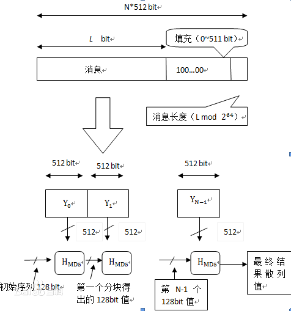

##  MD5如何生成的
[百度百科](https://baike.baidu.com/item/MD5)



##  生成MD5

### 1.通过摘要生成MD5

``` java
 MessageDigest md = MessageDigest.getInstance("MD5");
        md.update(input.getBytes(StandardCharsets.UTF_8));
        byte[] hashBytes = md.digest();
        StringBuilder sb = new StringBuilder();
        for (byte b : hashBytes) {
            sb.append(String.format("%02x", b));
        }
        return sb.toString();
```

### 2.使用Google的Guava生成MD5

- 添加依赖

``` xml
            <dependency>
              <groupId>com.google.guava</groupId>
              <artifactId>guava</artifactId>
              <version>28.1-jre</version>
          </dependency>
```
- 生成代码

 ``` java
   // com.google.common.hash.Hashing.md5()
          // If you must interoperate with a system that requires MD5, then use this method, despite its deprecation. But if you can choose your hash function, avoid MD5, which is neither fast nor secure. As of January 2017, we suggest:
          // For security: Hashing.sha256() or a higher-level API.
          // For speed: Hashing.goodFastHash(int), though see its docs for caveats.
          HashFunction hashFunction = Hashing.md5();
  
          HashCode hash = hashFunction.hashString(input, StandardCharsets.UTF_8);
          return hash.toString();
 ```

### 3.使用Appach的commons生成MD5

- 添加依赖

``` xml
<dependency>
            <groupId>commons-codec</groupId>
            <artifactId>commons-codec</artifactId>
            <version>1.13</version>
        </dependency>
```
- 生成代码

``` java
   String md5 = DigestUtils.md5Hex( input );
          return md5;
```

  

## 加盐MD5

### 为什么加盐

``` 
彩虹表是一个用于加密散列函数逆运算的预先计算好的表, 常用于破解加密过的密码散列。一般主流的彩虹表都在100G以上。 查找表常常用于包含有限字符固定长度纯文本密码的加密。这是以空间换时间的典型实践, 在每一次尝试都计算的暴力破解中使用更少的计算能力和更多的储存空间，但却比简单的每个输入一条散列的翻查表使用更少的储存空间和更多的计算性能。使用加盐的KDF函数可以使这种攻击难以实现。
```

### 什么是盐

1.  [密码加盐]([https://zh.wikipedia.org/wiki/%E7%9B%90_(%E5%AF%86%E7%A0%81%E5%AD%A6)](https://zh.wikipedia.org/wiki/盐_(密码学))
2. 本质就是增加要加密内容的单一性，使用复杂。比如：只对密码加密->对用户名和密码加密（一个不对全不对）->对用户名和密码再加随机数加密（为了验证，最终还是要报随机数的位置确定，验证前删除掉）

### 如何加盐

#### 加盐示例代码

``` java
public static String createMd5WithSalt(String input) throws NoSuchAlgorithmException {
        // MessageDigest instance for MD5
        MessageDigest md = MessageDigest.getInstance("MD5");

        // Generate the random salt
        SecureRandom random = new SecureRandom();
        byte[] salt = new byte[16];
        random.nextBytes(salt);
        md.update(salt);
        md.update(input.getBytes(StandardCharsets.UTF_8));
        byte[] hashBytes = md.digest();
        StringBuilder sb = new StringBuilder();
        for (byte b : hashBytes) {
            sb.append(String.format("%02x", b));
        }
        return sb.toString();
    }
```

#### 加盐并能重复验证

1. 一般一个系统会使用一个固定格式的盐 如用户名加密

2. 也有使用固定位数的盐的，如把盐按一定规律插入到生面的md5中，验证时从中取出盐，然后再校验

``` java
      private static Integer SALT_LENGTH = 16;
       private static Integer SALT_MD5_LENGTH = 48;
       private static Integer STEP_LENGTH = 3;
   public static String createMd5WithSalt(String input) throws NoSuchAlgorithmException {
   
            // 生成一个16位的随机数
           SecureRandom random = new SecureRandom();
           StringBuilder sBuilder = new StringBuilder(16);
           sBuilder.append(random.nextInt(66888888)).append(random.nextInt(66888888));
           int len = sBuilder.length();
           if (len < SALT_LENGTH) {
               for (int i = 0; i < SALT_LENGTH - len; i++) {
                   sBuilder.append("0");
               }
           }
           // 生成最终的加密盐
           String Salt = sBuilder.toString();
           String saltMd5 = createMd5(input + Salt);
           char[] cs = new char[SALT_MD5_LENGTH];
           for (int i = 0; i < SALT_MD5_LENGTH; i += STEP_LENGTH) {
               cs[i] = saltMd5.charAt(i / 3 * 2);
               char c = Salt.charAt(i / 3);
               cs[i + 1] = c;
               cs[i + 2] = saltMd5.charAt(i / 3 * 2 + 1);
           }
           return String.valueOf(cs);
       }
   
       public static boolean verifyMd5WithSalt(String input, String md5str) throws NoSuchAlgorithmException {
           char[] cs1 = new char[32];
           char[] cs2 = new char[16];
           for (int i = 0; i < SALT_MD5_LENGTH; i += STEP_LENGTH) {
               cs1[i / 3 * 2] = md5str.charAt(i);
               cs1[i / 3 * 2 + 1] = md5str.charAt(i + 2);
               cs2[i / 3] = md5str.charAt(i + 1);
           }
           String Salt = new String(cs2);
           return createMd5(input + Salt).equals(String.valueOf(cs1));
       }
   
   // 使用
    // 加盐
               String md5WithSalt = MessageDigestCreate.createMd5WithSalt("测试md5");
               System.out.println(md5WithSalt);
               System.out.println(MessageDigestCreate.verifyMd5WithSalt("测试md5",md5WithSalt));
   /**
   125214383c3b755320902731b46d79344914f2199c786272
   true
   */
   
```

-  建议使用安全随机数。