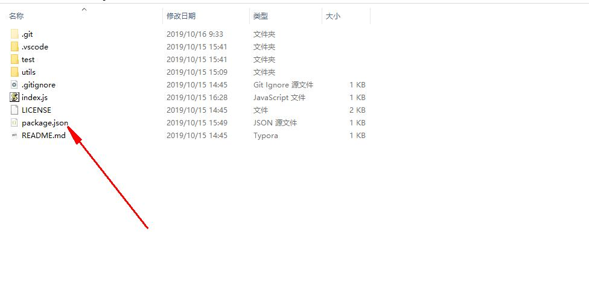

# 从零开始把项目发布到NPM仓库中心

###  前期准备

- [注册账号 https://www.npmjs.com/signup ]( https://www.npmjs.com/signup )

  ``` wi
  网易邮箱注册失败，用QQ邮箱成功
  
  ```

  - 使用npm 命令注册(建议使用网页)：

    ``` shell
    npm adduser 
    ```

      

- 然后命令行登录

  ``` shell
  npm login
  ```


### 新建工程

- 我的工程地址

   [https://github.com/Ants-double/huangdou ]( https://github.com/Ants-double/huangdou )

``` wiki
新建工程前最好先找一下是否已经存在
https://www.npmjs.com/
```

- 初始化工程

  ``` shell
  npm init 
  并填写相关信息
  ```

   
  
- 发布
  
  1. 命令行功换到package.json目录
  
  2. 执行命令
  
     ``` shell
     npm publish
     
     ```
  
  3. 如果之前设过cnpm 
  
     ``` shell
     npm config set registry https://registry.npmjs.org/，如果用了nrm工具，使用命令：nrm use npm 切换
     ```
  
     

### 更新发布

- 修改版本号(会自动加1)

  ``` shell
  npm version patch
  ```

  

- 重新发布

  ``` shell
  npm publish
  ```

### 删除包

- 删除指写的版本 只能24小时之内

   ``` shell
  npm unpublish 工程名@版本号
   ```

  

- 删除整个包

  ``` shell
  npm unpublish 包名 --force
  ```

  

### 相关工程代码

- 入口文件index.js

  ``` javascript
  const AntsArrayUtil=require("./utils/lib/AntsArrayUtil.js");
  const SocketBuffer=require("./utils/lib/SockBuffer");
  
  module.exports.AntsArrayUtil=AntsArrayUtil;
  module.exports.SocketBuffer=SocketBuffer;
  ```

  

- 工具类文件AntsArrayUtil.js

  ``` javascript
  
  
  module.exports = class AntsArrayUtil {
      constructor() {
  
      }
      
      // 拼接
      static write(array, split) {
          split = split || "#";
          return  this.checkArray(array,(value) => {
              return value.join(split);
          });
      }
  
      //去重
      static removeDuplicate(array) {
          return this.checkArray(array,(value) => {
              let set = new Set(value);
              return [...set];
          });
      }
  
      static maxValue(array) {
          return this.checkArray(array,(value) => {
              return Math.max(...value);
          });
      }
  
  
      static appendArray(array,appendArray){
          return this.checkArray(array,(value) => {
              return [...value,...appendArray];
          });
      }
  
  
      // 检查是不是数组
      static checkArray(array,callback) {
          if (Array.isArray(array)) {
              return callback(array);
          }
          else {
              return new Array();
          }
      };
  
  
  }
  
  
  
  ```

  

  