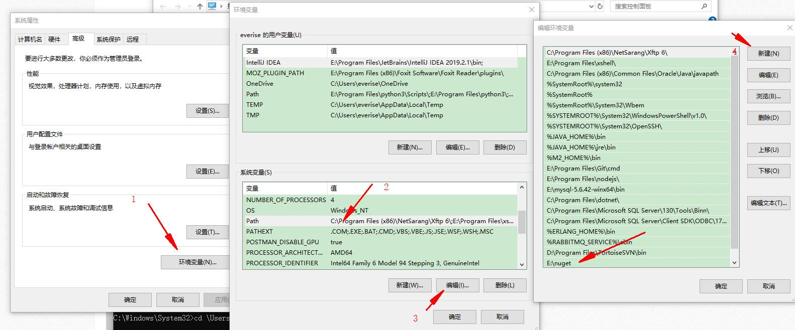
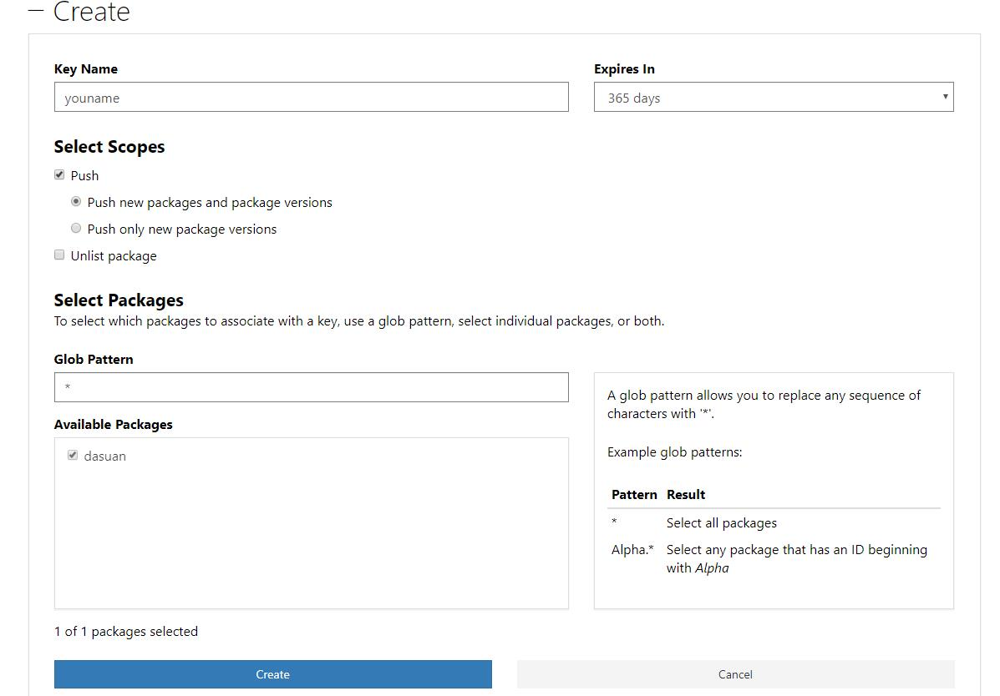
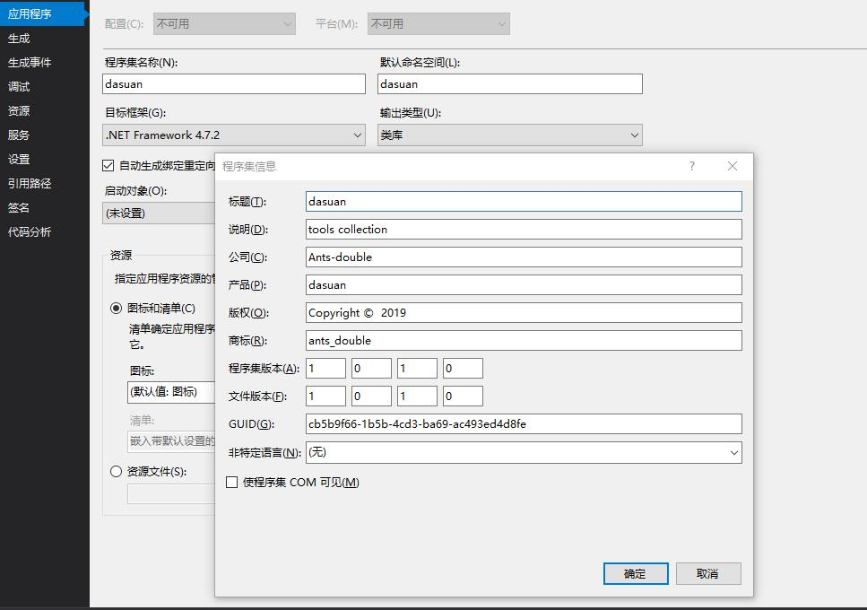
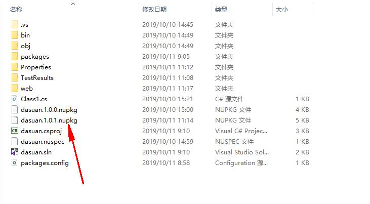
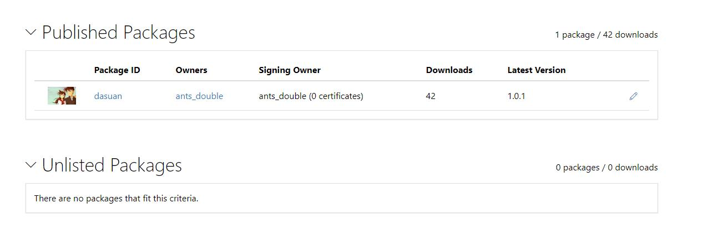

# 从零开始把项目发布到Nuget仓库中心

- 我的项目地址

  [ https://github.com/Ants-double/dasuan ]( https://github.com/Ants-double/dasuan )

 ### 前期准备

- 下载并注册nuget帐号
  - [下载地址 https://www.nuget.org/downloads ]( https://www.nuget.org/downloads )
  - 下载地址
    1. 如果有微软账号可以直接授权登录
    2. 如果之前有nuget账号，可以登录，但不可以使用。我就是这种情况，又绑定了微软账号才正常使用
    3. [注册地址 https://www.nuget.org/users/account/LogOn?returnUrl=%2Fdownloads ]( https://www.nuget.org/users/account/LogOn?returnUrl=%2Fdownloads )

-  将nuget.exe 添加到系统环境变量

  


- 登录官网创建APIKeys
  - [创建apikey https://www.nuget.org/account/apikeys ]( https://www.nuget.org/account/apikeys )
  - 
  -  **复制key密钥后面要用**

### 新建工程

- 创建动态库工程

- 修改工程程序集信息（工程右键->属性->程序集信息)

  

-  打开命令行，进入工程目录（也就是*.csproj）

- 执行下面的命令,生成.nuspec文件,

  ``` cmd
  nuget spec 工程名.csproj
  ```

  

- 用文本打开nuspec文件，添加项目发布信息

  ``` xml
  <?xml version="1.0"?>
  <package >
    <metadata>
      <id>$id$</id>
      <version>$version$</version>
      <title>$title$</title>
      <authors>$author$</authors>
      <owners>$author$</owners>
      <licenseUrl>http://www.apache.org/licenses/LICENSE-2.0</licenseUrl>
      <projectUrl>https://github.com/Ants-double/dasuan</projectUrl>
      <iconUrl>https://images.cnblogs.com/cnblogs_com/ants_double/1503498/o_01.jpg</iconUrl>
      <requireLicenseAcceptance>false</requireLicenseAcceptance>
      <description>$description$</description>
      <releaseNotes>Summary of changes made in this release of the package.</releaseNotes>
      <copyright>Copyright 2019</copyright>
      <tags>ants_double antsdouble</tags>
    </metadata>
  </package>
  ```

  

- 然后打包

  ``` cmd
  nuget pack
  ```

- 发布

  ``` shell
  nuget push dasuan.1.0.0.nupkg 官网上生成的apikey -Source https://api.nuget.org/v3/index.json
  替换之后格式如下
  nuget push KunCreateNF452.1.0.0.nupkg oy2l2lhljvoki6etvbbqwhu2zxovoaaulb6r5tvddfvx4y -Source https://api.nuget.org/v3/index.json
  ```

- 登录官网 帐号下可以查看

  


- 发布成功有邮件通知

 ### 更新发布

- 更改版本号
- 从新打包
- 发布

### 问题

- 发布失败
  
  1. 到帐号下面Account Setting 启动多因子验证
  
- 命令错误（看报错的原因）

  

#### 参考文档

-  https://docs.microsoft.com/zh-cn/nuget/quickstart/create-and-publish-a-package-using-visual-studio-net-framework 