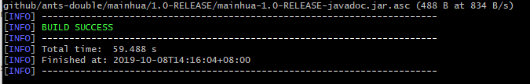
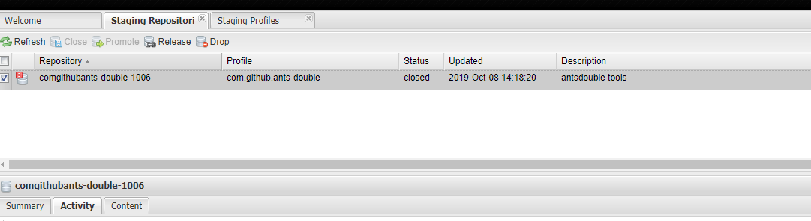
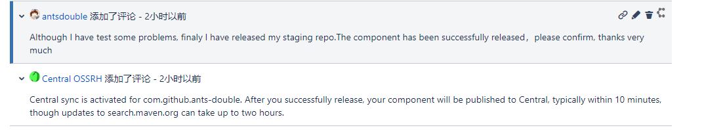
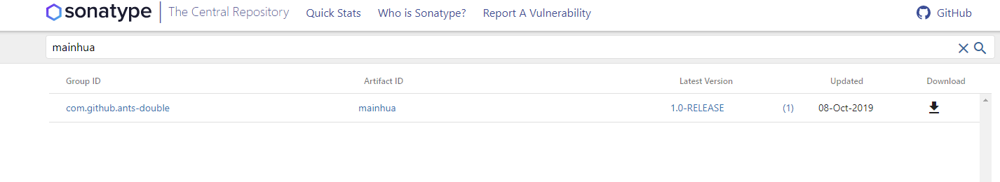

# 从零开始把项目发布到maven仓库中心

## sonatype准备操作

- 注册账号

  [https://issues.sonatype.org](https://issues.sonatype.org/)

  ``` wiki
  1. 密码符号规范，并且工记住
  ```

  

- 新建项目

  

``` wiki
1. group id 如果你有com域名的所有权可以直接使用，如果不符合可以使用com.github.{账号名来定义}
2. 如果有问题管理员会在下方留言通知你如下文（github所有权验证)
```


然后等会有类似的通知发出，并按通知进行操作。

``` wiki
When choosing a groupId that reflects your project hosting, in this case, something like io.github.ants-double or com.github.ants-double would be correct. Also, please create a public repo called OSSRH-52139 to verify github account ownership.
```

然后你就创建对应的公有仓库，等创建成功后在些回复一下，看到如下评论前期准备工作就正式结束了

``` wiki
com.github.ants-double has been prepared, now user(s) antsdouble,Ants-double can:

Deploy snapshot artifacts into repository https://oss.sonatype.org/content/repositories/snapshots
Deploy release artifacts into the staging repository https://oss.sonatype.org/service/local/staging/deploy/maven2
Release staged artifacts into repository 'Releases'
please comment on this ticket when you promoted your first release, thanks
```

## GPG的准备工作

- windows安装gpg https://www.gpg4win.org/get-gpg4win.html，这里使用git命令行工具

- 生成秘钥

  ``` wiki
  gpg --gen-key 按照提示输入姓名/邮箱，然后按O即可生成
  ```

- 查看秘钥

  ``` wiki
  gpg --list-keys
  ```

  

- 同步公钥

    ``` wiki
gpg --keyserver http://keys.gnupg.net:11371/ --send-keys [xxxxxxxxx] 其中的[xxxxxxxxx]，可用gpg --list-keys显示出来。
    ```

## Maven准备工作

- 更新setting.xml文件添加仓库

  ``` xml
  <server>
    <id>sonatype-nexus-snapshots</id>
    <username>Sonatype账号</username>
    <password>Sonatype密码</password>
  </server>
  <server>
    <id>sonatype-nexus-staging</id>
    <username>Sonatype账号</username>
    <password>Sonatype密码</password>
  </server>
  
  ```

- 修改pom.xml文件 增加许可协议、SCM信息、开发者信息 (最后附完整的pom.xml文件)

  ``` xml
  <licenses>
          <license>
              <name>The Apache Software License, Version 2.0</name>
              <url>http://www.apache.org/licenses/LICENSE-2.0.txt</url>
              <distribution>repo</distribution>
          </license>
      </licenses>
      <scm>
          <tag>master</tag>
          <url>git@github.com:Ants-double/mianhua.git</url>
          <connection>scm:git:git@github.com:Ants-double/mianhua.git</connection>
          <developerConnection>scm:git:git@github.com:Ants-double/mianhua.git</developerConnection>
      </scm>
      <developers>
          <developer>
              <name>ants-double</name>
              <email>ants_double@yeah.net</email>
              <organization>ants-double</organization>
          </developer>
      </developers>
  ```

- 添加相关插件和仓库信息

  ``` xml 
  <build>
                  <plugins>
                      <!-- Source -->
                      <plugin>
                          <groupId>org.apache.maven.plugins</groupId>
                          <artifactId>maven-source-plugin</artifactId>
                          <version>2.2.1</version>
                          <executions>
                              <execution>
                                  <phase>package</phase>
                                  <goals>
                                      <goal>jar-no-fork</goal>
                                  </goals>
                              </execution>
                          </executions>
                      </plugin>
                      <!-- Javadoc -->
                      <plugin>
                          <groupId>org.apache.maven.plugins</groupId>
                          <artifactId>maven-javadoc-plugin</artifactId>
                          <version>2.9.1</version>
                          <configuration>
                              <encoding>${chartset.UTF8}</encoding>
                              <aggregate>true</aggregate>
                              <charset>${chartset.UTF8}</charset>
                              <docencoding>${chartset.UTF8}</docencoding>
                          </configuration>
                          <executions>
                              <execution>
                                  <id>attach-javadocs</id>
                                  <phase>package</phase>
                                  <goals>
                                      <goal>jar</goal>
                                  </goals>
                                  <configuration>
                                      <additionalparam>-Xdoclint:none</additionalparam>
                                  </configuration>
                              </execution>
                          </executions>
                      </plugin>
                      <!-- GPG -->
                      <plugin>
                          <groupId>org.apache.maven.plugins</groupId>
                          <artifactId>maven-gpg-plugin</artifactId>
                          <version>1.5</version>
                          <executions>
                              <execution>
                                  <phase>verify</phase>
                                  <goals>
                                      <goal>sign</goal>
                                  </goals>
                              </execution>
                          </executions>
                      </plugin>
                      <!--Compiler-->
                      <plugin>
                          <groupId>org.apache.maven.plugins</groupId>
                          <artifactId>maven-compiler-plugin</artifactId>
                          <version>3.0</version>
                          <configuration>
                              <source>1.8</source>
                              <target>1.8</target>
                              <fork>true</fork>
                              <verbose>true</verbose>
                              <encoding>UTF-8</encoding>
                              <showWarnings>false</showWarnings>
                          </configuration>
                      </plugin>
                      <!--Release-->
                      <plugin>
                          <groupId>org.apache.maven.plugins</groupId>
                          <artifactId>maven-release-plugin</artifactId>
                          <version>2.5.1</version>
                      </plugin>
                  </plugins>
              </build>
              <distributionManagement>
                  <snapshotRepository>
                      <id>sonatype-nexus-snapshots</id>
                      <name>Sonatype Nexus Snapshots</name>
                      <url>https://oss.sonatype.org/content/repositories/snapshots/</url>
                  </snapshotRepository>
                  <repository>
                      <id>sonatype-nexus-staging</id>
                      <name>Nexus Release Repository</name>
                      <url>https://oss.sonatype.org/service/local/staging/deploy/maven2/</url>
                  </repository>
              </distributionManagement>
  ```

  

## 打包发布

- 使用 命令，一键打包。

  ``` wiki
  `mvn clean deploy -P <profile-id>` 
  ```

- 打包过程中会要求输入gpg密钥的`Passphase`信息，输入即可



- 然后到https://oss.sonatype.org/#stagingRepositories 查看，看到如下信息

  

- 然后去账号下面去回复评论,大概意思是我弄完了，你处理一下吧

  

- 最后在 nexus repository manager中staging repositories选中最新发布的项目，然后执行

  ``` wiki
  open -> closed
  closed->release
  执行完可以在activity中查看状态以角错误的原因
  ```

- 最后按官网上说的过一会，maven Center可以更久一点就能查到了。

  ``` wiki
  https://search.maven.org/
  
  https://mvnrepository.com/
  ```

  

- 附图

  

### 完整的pom.xml

``` xml
<?xml version="1.0" encoding="UTF-8"?>
<project xmlns="http://maven.apache.org/POM/4.0.0"
         xmlns:xsi="http://www.w3.org/2001/XMLSchema-instance"
         xsi:schemaLocation="http://maven.apache.org/POM/4.0.0 http://maven.apache.org/xsd/maven-4.0.0.xsd">
    <modelVersion>4.0.0</modelVersion>

    <groupId>com.github.ants-double</groupId>
    <artifactId>mainhua</artifactId>
    <version>1.0-RELEASE</version>

    <name>mainhua</name>
    <url>https://github.com/Ants-double/mianhua</url>
    <description>常用工具集成</description>

    <properties>
        <!-- Environment Settings -->
        <java.version>1.8</java.version>

        <maven.compiler.encoding>UTF-8</maven.compiler.encoding>
        <chartset.UTF8>UTF-8</chartset.UTF8>
        <project.build.sourceEncoding>UTF-8</project.build.sourceEncoding>
        <project.reporting.outputEncoding>UTF-8</project.reporting.outputEncoding>
        <!--        json-->
        <project.fastjson.version>1.2.56</project.fastjson.version>
        <lombok.version>1.18.8</lombok.version>
        <project.test.version>4.12</project.test.version>

    </properties>

    <dependencyManagement>
        <dependencies>
            <dependency>
                <groupId>com.alibaba</groupId>
                <artifactId>fastjson</artifactId>
                <version>${project.fastjson.version}</version>
            </dependency>
            <dependency>
                <groupId>org.projectlombok</groupId>
                <artifactId>lombok</artifactId>
                <version>${lombok.version}</version>
            </dependency>
            <dependency>
                <groupId>junit</groupId>
                <artifactId>junit</artifactId>
                <version>${project.test.version}</version>
                <scope>test</scope>
            </dependency>
        </dependencies>
    </dependencyManagement>
    <dependencies>
        <dependency>
            <groupId>com.alibaba</groupId>
            <artifactId>fastjson</artifactId>
        </dependency>
        <dependency>
            <groupId>org.projectlombok</groupId>
            <artifactId>lombok</artifactId>
        </dependency>
        <dependency>
            <groupId>junit</groupId>
            <artifactId>junit</artifactId>
        </dependency>
    </dependencies>
    <licenses>
        <license>
            <name>The Apache Software License, Version 2.0</name>
            <url>http://www.apache.org/licenses/LICENSE-2.0.txt</url>
            <distribution>repo</distribution>
        </license>
    </licenses>
    <scm>
        <tag>master</tag>
        <url>git@github.com:Ants-double/mianhua.git</url>
        <connection>scm:git:git@github.com:Ants-double/mianhua.git</connection>
        <developerConnection>scm:git:git@github.com:Ants-double/mianhua.git</developerConnection>
    </scm>
    <developers>
        <developer>
            <name>ants-double</name>
            <email>ants_double@yeah.net</email>
            <organization>ants-double</organization>
        </developer>
    </developers>
    <profiles>
        <profile>
            <id>Releases</id>
            <build>
                <plugins>
                    <!-- Source -->
                    <plugin>
                        <groupId>org.apache.maven.plugins</groupId>
                        <artifactId>maven-source-plugin</artifactId>
                        <version>2.2.1</version>
                        <executions>
                            <execution>
                                <phase>package</phase>
                                <goals>
                                    <goal>jar-no-fork</goal>
                                </goals>
                            </execution>
                        </executions>
                    </plugin>
                    <!-- Javadoc -->
                    <plugin>
                        <groupId>org.apache.maven.plugins</groupId>
                        <artifactId>maven-javadoc-plugin</artifactId>
                        <version>2.9.1</version>
                        <configuration>
                            <encoding>${chartset.UTF8}</encoding>
                            <aggregate>true</aggregate>
                            <charset>${chartset.UTF8}</charset>
                            <docencoding>${chartset.UTF8}</docencoding>
                        </configuration>
                        <executions>
                            <execution>
                                <id>attach-javadocs</id>
                                <phase>package</phase>
                                <goals>
                                    <goal>jar</goal>
                                </goals>
                                <configuration>
                                    <additionalparam>-Xdoclint:none</additionalparam>
                                </configuration>
                            </execution>
                        </executions>
                    </plugin>
                    <!-- GPG -->
                    <plugin>
                        <groupId>org.apache.maven.plugins</groupId>
                        <artifactId>maven-gpg-plugin</artifactId>
                        <version>1.5</version>
                        <executions>
                            <execution>
                                <phase>verify</phase>
                                <goals>
                                    <goal>sign</goal>
                                </goals>
                            </execution>
                        </executions>
                    </plugin>
                    <!--Compiler-->
                    <plugin>
                        <groupId>org.apache.maven.plugins</groupId>
                        <artifactId>maven-compiler-plugin</artifactId>
                        <version>3.0</version>
                        <configuration>
                            <source>1.8</source>
                            <target>1.8</target>
                            <fork>true</fork>
                            <verbose>true</verbose>
                            <encoding>UTF-8</encoding>
                            <showWarnings>false</showWarnings>
                        </configuration>
                    </plugin>
                    <!--Release-->
                    <plugin>
                        <groupId>org.apache.maven.plugins</groupId>
                        <artifactId>maven-release-plugin</artifactId>
                        <version>2.5.1</version>
                    </plugin>
                </plugins>
            </build>
            <distributionManagement>
                <snapshotRepository>
                    <id>sonatype-nexus-snapshots</id>
                    <name>Sonatype Nexus Snapshots</name>
                    <url>https://oss.sonatype.org/content/repositories/snapshots/</url>
                </snapshotRepository>
                <repository>
                    <id>sonatype-nexus-staging</id>
                    <name>Nexus Release Repository</name>
                    <url>https://oss.sonatype.org/service/local/staging/deploy/maven2/</url>
                </repository>
            </distributionManagement>

        </profile>
    </profiles>
</project>
```

### 出现的问题

1. java1.8javadoc严格验证

   ``` wiki
   解决是添加
    <configuration>
                                       <additionalparam>-Xdoclint:none</additionalparam>
                                   </configuration>
   ```

   

2.  项目id不存在，解决是添加命名的项目id