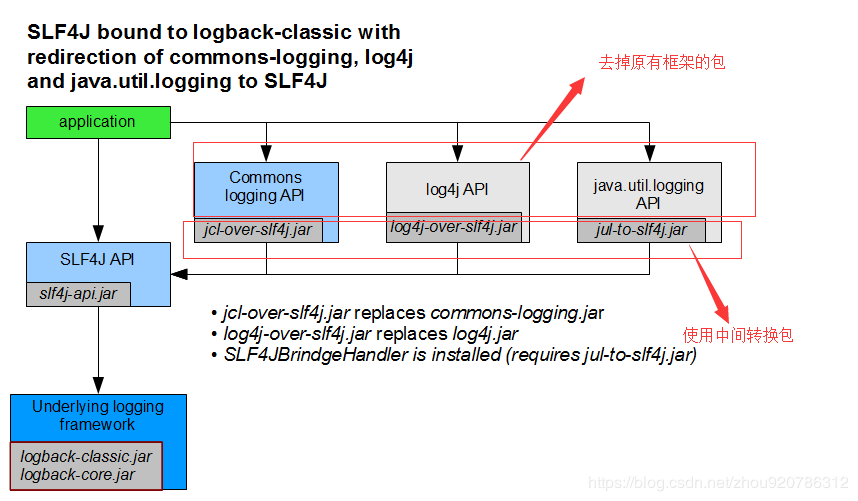

# spring boot 日志

### 1. 选择那种日志框架

``` wiki
slf4j 是抽像的接口层。也是spring boot 默认采用的接口层。

util.logging,log4j,logback,commons-logging默认采用的logback新一代的框架.其它的则是spring使用不的适配器来动态绑定到不同的日志框架上。也有为了适配不同的第三方包使用统一的日志框架，而生出的包装第三方日志框架的适配包，并动态bind到logback上。
```


### 2.第三方包日志框架不一致如何解决

**结果是直接排除第三方包的日志框架。**

``` wiki

因为spring-boot-starter-web中引过了logging的starter
```

``` xml
<dependency>
  <groupId>org.springframework.boot</groupId>
  <artifactId>spring-boot-starter-logging</artifactId>
</dependency>
```



### 3.如何在properties或yml中配置日志及优先级

#### 1) 设置的优先级

**外部文件>内部文件同级别的properties>yml，但是如果同时配置，会叠加生效**

#### 2) 配置文件设置

``` yaml
logging:
  level:
    org.springframework: ERROR
    com.antsdouble: DEBUG
  pattern:
    console: "%d{HH:mm:ss.SSS} [%t] %-5level %logger{36} - %msg%n"
    file: "%d %p %c{1.} [%t] %m%n"
  file: app.log
```

#### 3) 日志的常识

- 日志级别从低到高分为TRACE < DEBUG < INFO < WARN < ERROR < FATAL，只会输出大于或等于设置级别的内容
- 命令行参数--debug会启动debug模式
- logging.file 设置文件，lobbing.path设置路径，如果只设了路径会生成默认文件名spring.log,但是同时设置path不生效
- 默认情况10M会切分日志，并按不同级别生成不同文件

### 4.使用xml形式来配置日志

在resources资源目录下添加logback.xml文件并添加如下内容

``` xml
<?xml version="1.0" encoding="UTF-8"?>
<configuration  scan="true" scanPeriod="60 seconds" debug="false">
     <contextName>logback</contextName>
    <property name="HOME_LOG" value="logs/app.log"/>

    <!--输出到控制台-->
    <appender name="console" class="ch.qos.logback.core.ConsoleAppender">
        <!-- <filter class="ch.qos.logback.classic.filter.ThresholdFilter">
             <level>ERROR</level>
         </filter>-->
        <encoder>
            <pattern>%d{HH:mm:ss.SSS} %contextName [%thread] %-5level %logger{36} - %msg%n</pattern>
        </encoder>
    </appender>
    <!--输出到文件-->
    <appender name="FILE-ROLLING" class="ch.qos.logback.core.rolling.RollingFileAppender">
        <file>${HOME_LOG}</file>

        <rollingPolicy class="ch.qos.logback.core.rolling.SizeAndTimeBasedRollingPolicy">
            <fileNamePattern>logs/archived/app.%d{yyyy-MM-dd}.%i.log</fileNamePattern>
            <!-- each archived file, size max 10MB -->
            <maxFileSize>10MB</maxFileSize>
            <!-- total size of all archive files, if total size > 20GB,
				it will delete old archived file -->
            <totalSizeCap>20GB</totalSizeCap>
            <!-- 60 days to keep -->
            <maxHistory>60</maxHistory>
        </rollingPolicy>

        <encoder>
            <pattern>%d %p %c{1.} [%t] %m%n</pattern>
        </encoder>
    </appender>

    <logger name="com.antsdouble" level="debug" additivity="false">

        <appender-ref ref="console"/>
    </logger>

    <root level="debug">
        <appender-ref ref="console"/>
        <appender-ref ref="FILE-ROLLING"/>
    </root>

</configuration>

```

- 参数说明
```wiki
  1. scan 为真时，配置文件更新会被重新加载，默认为真

  2. scanPeriod:设置监测配置文件是否有修改的时间间隔，如果没有给出时间单位，默认单位是毫秒。当scan为true时，此属性生效。默认的时间间隔为1分钟

  3. debug:当此属性设置为true时，将打印出logback内部日志信息，实时查看logback运行状态。默认值为false

  4. contextName:每个logger都关联到logger上下文，默认上下文名称为“default”。但可以使用设置成其他名字，用于区分不同应用程序的记录。一旦设置，不能修改,可以通过%contextName来打印日志上下文名称。

  5. appender :appender用来格式化日志输出节点，有俩个属性name和class，class用来指定哪种输出策略，常用就是控制台输出策略和文件输出策略

  6. root :root节点是必选节点，用来指定最基础的日志输出级别，只有一个level属性

     level:用来设置打印级别，大小写无关：TRACE, DEBUG, INFO, WARN, ERROR, ALL 和 OFF，不能设置为INHERITED或者同义词NULL。
     默认是DEBUG。
     可以包含零个或多个元素，标识这个appender将会添加到这个logger

  7. logger :是按不同的包指定不同的级别，带有多个logger的配置，指定级别，指定appender
```

### 5.日志文件如何支持profile

- 在资源目录下添加logback-spring.xml文件，框架的自动配置类会接管日志文件的配置

``` xml
<?xml version="1.0" encoding="UTF-8"?>
<configuration>
    <include resource="org/springframework/boot/logging/logback/defaults.xml" />

    <springProfile name="default">
        <include resource="org/springframework/boot/logging/logback/console-appender.xml"/>

        <root level="INFO">
            <appender-ref ref="CONSOLE"/>
        </root>
    </springProfile>
<!-- 测试环境+开发环境. 多个使用逗号隔开. -->
<springProfile name="test,dev">
    <logger name="com.dudu.controller" level="info" />
</springProfile>
    <springProfile name="prod">

        <appender name="FILE-ROLLING" class="ch.qos.logback.core.rolling.RollingFileAppender">
            <file>app.log</file>

            <rollingPolicy class="ch.qos.logback.core.rolling.SizeAndTimeBasedRollingPolicy">
                <fileNamePattern>logs/archived/app.%d{yyyy-MM-dd}.%i.log</fileNamePattern>
                <!-- each archived file, size max 10MB -->
                <maxFileSize>10MB</maxFileSize>
                <!-- total size of all archive files, if total size > 20GB, it will delete old archived file -->
                <totalSizeCap>20GB</totalSizeCap>
                <!-- 60 days to keep -->
                <maxHistory>60</maxHistory>
            </rollingPolicy>

            <encoder>
                <pattern>%d %p %c{1.} [%t] %m%n</pattern>
            </encoder>
        </appender>

        <logger name="org.springframework" level="INFO"/>
        <logger name="com.mkyong" level="DEBUG"/>
        <root level="ERROR">
            <appender-ref ref="FILE-ROLLING"/>
        </root>
    </springProfile>

</configuration>

```

- 支持多环境日志springProfile添加多个配置段来实现

  ```java
  java -jar xxx.jar –spring.profiles.active=prod
  ```

  